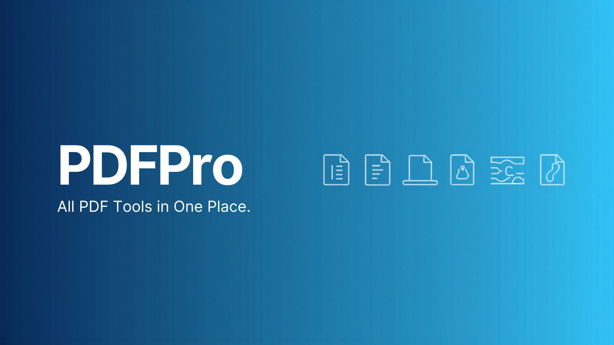

# 📄 **PDFPro — All PDF Tools in One Place**  
*A blazing‑fast, privacy‑first PDF toolkit built with React + Vite.*

---
<p align="center">
  
</p>

## 🏷️ **Badges**

<p align="left">
  
  
  
  
</p>

### 🧰 **Tech Stack**
<p align="left">
  
  
  
  
</p>

---

# 🚀 **Overview**

**PDFPro** is a modern, lightweight, and secure PDF utility that runs entirely in your browser.  
No uploads. No servers. No tracking.  
Just fast, offline‑capable PDF tools powered by cutting‑edge web technologies.

---

# ✨ **Features**

- 🔗 **Merge PDFs** — Combine multiple files into one  
- ✂️ **Split PDFs** — Extract pages or ranges  
- 🗜️ **Compress PDFs** — Reduce file size efficiently  
- 🔄 **Convert** — Images ↔ PDF, Text ↔ PDF  
- 🔧 **Reorder Pages** — Drag‑and‑drop interface  
- 🔒 **Privacy‑First** — All processing happens locally  
- ⚡ **Ultra‑Fast** — Vite + optimized JS utilities  
- 🎨 **Clean UI** — TailwindCSS responsive design  

---

# 🎥 **Screenshots & Demo**

### 🌐 **Live Demo**  
👉https://data-analysis-bi.github.io/pdf-pro/

### 🖼️ **Screenshots**

> Replace these with real screenshots later.

<p align="center">
  
  <br/>
  <em>Home Screen</em>
</p>

<p align="center">
  
  <br/>
  <em>PDF Tools Interface</em>
</p>

### 🎬 **Demo GIF**

> Add a GIF showing merging/splitting PDFs.

```
assets/demo.gif
```

---

# 🛠️ **Tech Architecture**

PDFPro is built with a modular, scalable architecture:

```
pdf-pro/
│
├── public/                 # Static assets
├── src/
│   ├── pdfUtils.js         # Core PDF processing logic
│   ├── components/         # Reusable UI components
│   ├── pages/              # Page-level views
│   ├── hooks/              # Custom React hooks
│   ├── styles/             # Tailwind + custom CSS
│   └── utils/              # Helper utilities
│
├── index.html
├── package.json
├── vite.config.js
└── tailwind.config.js
```

### 🧠 **Core Concepts**

- **Client‑side PDF processing** using browser APIs  
- **Zero‑backend architecture** for maximum privacy  
- **Optimized bundling** via Vite  
- **Atomic UI components** for scalability  
- **Tailwind utility classes** for rapid styling  

---

# ⚙️ **Getting Started**

### 1️⃣ Clone the repo  
```bash
git clone https://github.com/data-analysis-bi/pdf-pro.git
cd pdf-pro
```

### 2️⃣ Install dependencies  
```bash
npm install
```

### 3️⃣ Start development  
```bash
npm run dev
```

### 4️⃣ Build for production  
```bash
npm run build
```

---

# 🤝 **Contributing**

Contributions are welcome!  
You can help by:

- Adding new PDF tools  
- Improving UI/UX  
- Enhancing performance  
- Fixing bugs  
- Writing documentation  

Submit a PR anytime.

---

# 📜 **License**

This project is licensed under the **MIT License**.

---

# ⭐ **Support the Project**

If you like PDFPro, please consider giving the repo a ⭐  
It helps visibility and motivates further development.

---
